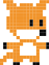

# 撿硬幣

你就是狐狸，你可以用方向鍵移動。螢幕上會出現硬幣，狐狸碰到硬幣就得 10 分，而且會有新的硬幣在其它地方等你去收集。 7 秒後遊戲會結束，收集愈多愈高分。

## 程式流程


## 開工

1. 新增目錄 `coin_collector`，新增檔案 `coin.py`
2. 新增 `images` 目錄 (存放圖形檔)
3. 將狐狸和硬幣，存到 `images` 內
    
    

4. 開始：調整視窗大小

    ```python
    WIDTH = 400
    HEIGHT = 400
    ```

5. 設定初始分數

    ```python
    score = 0
    ```

6. Game over? (`True` or `False`)

    ```python
    game_over = False
    ```

7. `Actor` ，這個遊戲有 2 個角色圖片： `fox`, `coin`

    ```python
    fox = Actor("fox")
    fox.pos = 100, 100

    coin = Actor("coin")
    coin.pos = 200, 200
    ```

8. 畫出基本畫面：狐狸、硬幣、分數

    ```python
    def draw():
        screen.fill("green")
        fox.draw()
        coin.draw()
        screen.draw.text(f"Score: {score}", color="black", topleft=(10, 10))
    ```

9. 執行一下吧
10. 有時，程式寫到一半，先執行一下，看看有沒有 bug
11. 先定義一先預定函數吧： `place_coin()`, `time_up()`, `update()`

    ```python
    def place_coin():
        pass

    def time_up():
        pass

    def update():
        pass
    ```

12. 加個取亂數的外掛工具 importing randint()

    ```python
    from random import randint
    ```

13. `place_the_coin`

    ```python
    def place_coin():
        coin.x = randint(20, (WIDTH - 20))
        coin.y = randint(20, (HEIGHT - 20))
    ```

14. 定義好還不夠，要呼叫他才會執行

    ```python
    place_coin()
    ```

15. `time_up`

    ```python
    def time_up():
        global game_over
        game_over = True
    ```

16. 設定 timer：7秒後，遊戲結束，你可以使用內建的函數 [`clock`](https://pygame-zero.readthedocs.io/en/stable/builtins.html#clock)

    ```python
    clock.schedule(time_up, 7.0)
    ```

17. 時間到，遊戲結束

    ```python
    if game_over:
        screen.fill("pink")
        screen.draw.text(f"Final Score: {score}", topleft=(10, 10), fontsize=60)
    ```

18. using `update()`：這是 pygame zero 內建的函數，他在系統的 `game loop` 被循環執行著

    ```python
    def update():
        if keyboard.left:
            fox.x = fox.x -2
    ```

19. 執行一下，狐狸可以往左移動，如果沒問題就加上另外三個方向的移動

    ```python
    def update():
        if keyboard.left:
            fox.x = fox.x -2
        elif keyboard.right:
            fox.x = fox.x + 2
        elif keyboard.up:
            fox.y = fox.y - 2
        elif keyboard.down:
            fox.y = fox.y + 2
    ```

20. 收集硬幣，如果兩張圖**相碰**，是不是表示狐狸抓到硬幣了，可以使用 [`colliderect`](https://www.pygame.org/docs/ref/rect.html#pygame.Rect.colliderect)

    ```python
    def update():
        global score

        ...略

        coin_collected = fox.colliderect(coin)

        if coin_collected:
            score = score + 10
            place_coin()
    ```

21. 完工，試一試，你可以得幾分！

## 練習

1. 不喜歡狐狸，換！
2. 實在是太快了，時間可以調久一點嗎？
3. 可以調整遊戲視窗大小 (WIDTH, HEIGHT)
4. 沒看過跑這麼慢的狐狸，可以跑快一點嗎？