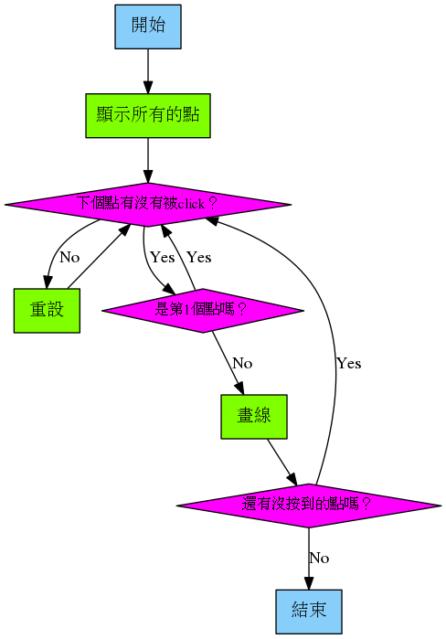

# 連連看

## 程式流程



## 開工

1. 新增檔案
2. 另存新檔： `numbers.py`
3. 新增 `images` 目錄 (存放圖形檔)
4. 把點點圖放到 images

    

5. 載入外掛

    ```python
    from random import randint
    ```

6. 設定視窗大小 (400x400)

    ```python
    WIDTH = 400
    HEIGHT = 400
    ```

7. 你需要一些 `list` 來儲存 **點** 和 **線**

    ```python
    dots = []
    lines = []

    next_dot = 0
    ```

8. Actor，我們將產生 10 個點

    ```python
    for dot in range(0, 10):
        actor = Actor("dot")
        actor.pos = randint(20, WIDTH - 20), randint(20, HEIGHT - 20)
        dots.append(actor)
    ```

9. 畫出所有的點點 (Actor)

    ```python
    def draw():
        screen.fill("black")
        number = 1
        for dot in dots:
            screen.draw.text(str(number), (dot.pos[0], dot.pos[1] + 12))
            dot.draw()
            number = number + 1
    ```

10. 畫線

    ```python

    ```

11. 跑一下程式，看看到目前有沒有問題
12. 你會看到：
13. 偵測滑鼠 `on_mouse_down` ，如果要更改全域變數，需宣告 `global`

    ```python
    def on_mouse_donw(pos):
        global next_dot
        global lines
    ```

14. 連結點 (畫出線)

    ```python
    def on_mouse_down(pos):
        global next_dot
        global lines

        if dots[next_dot].collidepoint(pos):
            if next_dot:
                lines.append((dots[next_dot - 1].pos, dots[next_dot].pos))
                print((dots[next_dot - 1].pos, dots[next_dot].pos))
            next_dot = next_dot + 1
        else:
            lines = []
            next_dot = 0
    ```

15. 收工

## 練習

1. 你有沒有發現，所有的點都連完後，再按一次，程式會出現錯誤訊息
2. 可以多畫一些點嗎？我們在步驟 8 畫了 10 個點
3. 增加關卡難度：完成後，可以每次多加入 2 個點

    ```python
    # 新增一個變數，儲存這個關卡有幾個點
    number_of_dots = 10

    # 新增一個函數，在過關後加入 2 個新的點
    def next_level:

    # 判斷何時需要加入新的點
    if next_dot === number_of_dots -1;
    ```

4. 你有沒有發現，有些點會碰在一起，你可以讓他們不要碰在一起嗎？