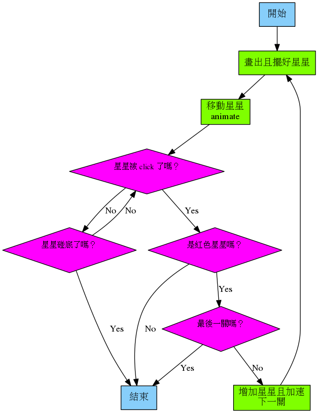

# 紅色警戒

蘋果出現，用滑鼠 click，打中說「你好棒！」，沒打中就結束

## 程式流程



## 開工

1. 新增檔案
2. 另存新檔： `red.py`
3. 新增 `images` 目錄 (存放圖形檔)
4. 把用到的圖存到 `images` 內。 (png, gif, jpg)
    * [blue-star](./code/images/blue-star.png)
    * [green-star](./code/images/green-star.png)
    * [red-star](./code/images/red-star.png)
    * [space](./code/images/space.png)

5. 加入外掛 (`random`)：我們會用到 `choice()`, `shuffle()`

    ```python
    import random
    ```

6. 設定一些**常數**

    ```python
    FONT_COLOR = (255, 255, 255) 
    WIDTH = 800
    HEIGHT = 600
    CENTER_X = WIDTH / 2
    CENTER_Y = HEIGHT /2
    CENTER = (CENTER_X, CENTER_Y)
    FINAL_LEVEL = 6
    START_SPEED = 10
    COLORS = ["green", "blue"]
    ```

7. 宣告一些**全域變數** (global variable)

    ```python
    game_over = False
    game_complete = False
    current_level = 1
    stars = []
    animations = []
    ```

8. 畫出星星

    ```python
    def draw():
        global stars, current_level, game_over, game_complete
        screen.clear()
        screen.blit("space", (0, 0))
        if game_over:
            display_message("GAME OVER!", "Try again.")
        elif game_complete:
            display_message("YOU WON!", "Well done.")
        else:
            for star in stars:
                star.draw()
    ```

9. `update()`

    ```python
    def update():
        global stars
        if len(stars) == 0:
            stars = make_stars(current_level)
    ```

10. `make_stars()`

    ```python
    def make_stars(number_of_extra_stars):
        colors_to_create = get_colors_to_create(number_of_extra_stars)
        new_stars = create_stars(colors_to_create)
        layout_stars(new_stars)
        animate_stars(new_stars)
        return new_stars
    ```

11. 加入一些**預留函數**

    ```python
    def get_colors_to_create(number_of_extra_stars):
        return []

    def create_stars(colors_to_create):
        return []

    def layout_stars(stars_to_layout):
        pass

    def animate_stars(stars_to_animate):
        pass
    ```

12. 測試一下吧

13. Get a list of colors

    ```python
    def get_colors_to_create(number_of_extra_stars):
        colors_to_create = ["red"]
        for i in range(0, number_of_extra_stars):
            random_color = random.choice(COLORS)
            colors_to_create.append(random_color)
        return colors_to_create
    ```

14. Create the stars

    ```python
    def create_stars(colors_to_create):
        new_stars = []
        for color in colors_to_create:
            star = Actor(f"{color}-star")
            new_stars.append(star)
        return new_stars
    ```

15. 試看看：你會看到所有的星星畫在左上角

16. 排好星星 `layout_stars()`

    ```python
    def layout_stars(stars_to_layout):
        number_of_gaps = len(stars_to_layout) + 1
        gap_size = WIDTH / number_of_gaps
        random.shuffle(stars_to_layout)
        for index, star in enumerate(stars_to_layout):
            new_x_pos = (index + 1) * gap_size
            star.x = new_x_pos
    ```

17. 再測試一下，看星星是不是有排好

18. 移動星星吧 `animate_stars()`，這裡有用到 [`animate()`](https://pygame-zero.readthedocs.io/en/stable/builtins.html#animations)

    ```python
    def animate_stars(stars_to_animate):
        for star in stars_to_animate:
            duration = START_SPEED  - current_level
            star.anchor = ("center", "bottom")
            animation = animate(star, duration=duration, on_finished=handle_game_over, y=HEIGHT)
            animations.append(animation)
    ```

19. Game over `handle_game_over()`

    ```python
    def handle_game_over():
        global game_over
        game_over = True
    ```

20. 處理滑鼠 `on_mouse_down()`

    ```python
    def on_mouse_down(pos):
        global stars, current_level
        for star in stars:
            if star.collidepoint(pos):
                if "red" in star.image:
                    red_star_click()
                else:
                    handle_game_over()
    ```

21. 紅色星星被點擊 `red_star_click()`

    ```python
    def red_star_click():
        global current_level, stars, animations, game_complete
        stop_animations(animations)
        if current_level == FINAL_LEVEL:
            game_complete = True
        else:
            current_level = current_level + 1
            stars = []
            animations = []
    ```

22. 停止 animation

    ```python
    def stop_animations(animations_to_stop):
        for animation in animations_to_stop:
            if animation.running:
                animation.stop()
    ```

23. `display_message()`

    ```python
    def display_message(heading_text, sub_heading_text):
        screen.draw.text(heading_text, fontsize=60, center=CENTER, color=FONT_COLOR)
        screen.draw.text(sub_heading_text, fontsize=30, center=(CENTER_X, CENTER_Y+30), color=FONT_COLOR)
    ```

## 練習

1. 改變 Actor，不要用星星，用別的圖樣
2. 改變星星移動的速度，可以在 `animate_stars()` 函數內加入

    ```python
    random_speed_adjustment = random.randint(0,2)
    duration = START_SPEED - current_level + random_speed_adjustment
    ```

3. 改變方向，需更動 `layout_stars()`, `animate_stars()`

    ```python
    # 在 layout_stars
    star.x = new_x_pos
    if index % 2 == 0:
        star.y = 0
    else:
        star.y = HEIGHT

    # 在 animate_stars 內，需移動方向，記得更改 anchor
    ```

4. 遊戲結束後，按空白鍵再完一次

    ```python
    def update():
    global stars, game_complete, game_over, current_level
    if len(stars) == 0:
        stars = make_stars(current_level)
    if (game_complete or game_over) and keyboard.space:
        stars = []
        current_level = 1
        game_complete = False
        game_over = False
    ```