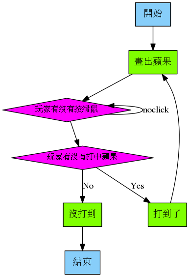
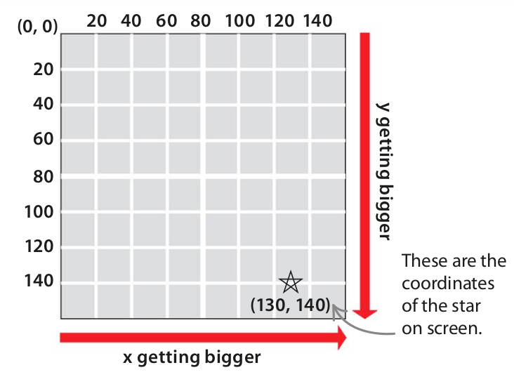

# 射蘋果

蘋果出現，用滑鼠 click，打中說「你好棒！」，沒打中就結束

## 程式流程



## 開工

1. 新增檔案
2. 另存新檔： `shooting.py`
3. 新增 `images` 目錄 (存放圖形檔)
4. 買些水果，存到 `images` 內。 (png, gif, jpg)

    

5. 使用 `Actor` 引進蘋果那張圖

    ```python
    apple = Actor('apple')
    ```

6. 在螢幕上畫出蘋果

    ```python
    def draw():
        screen.clear()
        apple.draw()
    ```

7. 執行看看吧 `pgzrun shoot.py`
8. 如果都沒錯誤，你得到了一個程式視窗，上面畫了一顆蘋果
9.  把蘋果換個位置吧 (解釋一下 coordinates)

    

    ```python
    def place_apple():
        apple.x = 200
        apple.y = 300
    ```

10. 執行換蘋果位置的函數

    ```python
    place_apple()
    ```

11. 再跑 (run) 一次程式看看是不是真得換位置了
12. 處理滑鼠的點擊

    ```python
    def on_mouse_down(pos):
        print("喔，準哦！")
        place_apple()
    ```

    ```python
    # 如果不能顯示中文，請照此方法處理：
    # 看錯誤訊息，找到該檔案，打開檔案，找到指定的行數，在 open 的地方加入
    mode="rb"
    ```

13. 加入一些邏輯判斷，不要亂按都說準

    ```python
    def on_mouse_down(pos):
        if apple.collidepoint(pos):
            print("喔，準哦！")
            place_apple()
    ```

14. 如果沒按中蘋果 Game over!

    ```python
    def on_mouse_down(pos):
        if apple.collidepoint(pos):
            print("喔，準哦！")
            place_apple()
        else:
            print("打不到打不到！")
            quit()
    ```

15. 每次都在同個位置，可以隨機嗎？python 的 `random` 模組裡有一個 `randint` 可以取出一個範圍內的亂數這個工具，但是我們要先將他**拿出來**

    ```python
    from random import randint
    ```

16. 在 `place_apple` 使用 `randint`

    ```python
    def place_apple():
        apple.x = randint(10, 800)
        apple.y = randint(10, 600)
    ```

17. 射擊時間！

## 練習

1. 不喜歡蘋果，換！
2. 你也幫幫忙，幫忙算一下打中幾次
3. 繼續玩，不要一次沒中就結束
4. 打中後，可以增加一下圖片效果嗎